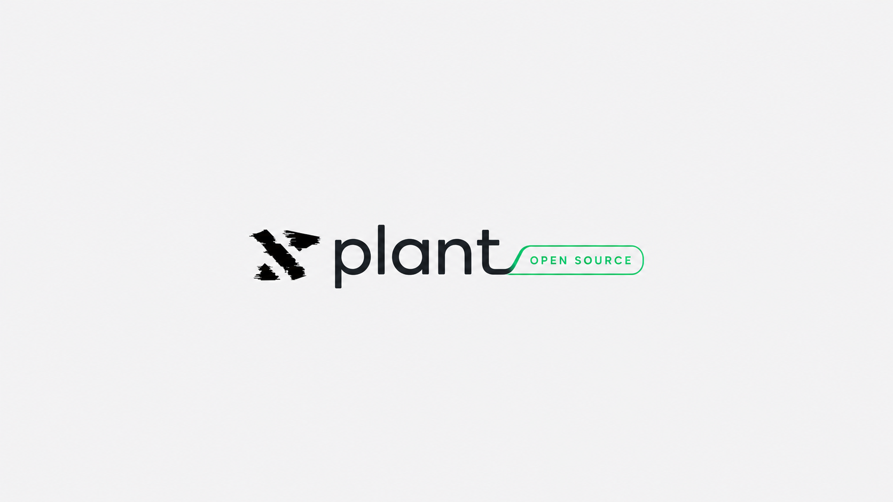

<p align="center">
  
</p>
<p align="center">
  Open-source SDKs, firmware, and hardware bridges for connecting physical lab devices to <a href="https://xplant.shmaplex.com">xPlant</a>.
</p>

<p align="center">
  <a href="LICENSE"></a>
  <a href="https://github.com/shmaplex/xplant_os/pulls"></a>
  <a href="#"></a>
</p>

---

xplant_os is the open-source companion to [xPlant](https://xplant.shmaplex.com) — a collection of SDKs, firmware examples, and hardware bridges for connecting physical lab devices and external software to your xPlant workspace.

Production auth, user data, billing, RLS policies, and application secrets live exclusively in the main xPlant app and are never part of this repository.

---

## Table of Contents

- [Getting Started](#getting-started)
- [Packages](#packages) — JavaScript/TypeScript SDK
- [Devices](#devices) — ESP32, Raspberry Pi, ESPHome, Tasmota
- [Examples](#examples) — Minimal working examples
- [Documentation](#documentation)
- [Contributing](#contributing)
- [Security](#security)
- [License](#license)

---

## Getting Started

**1. Get your API key**

Log in to [xplant.shmaplex.com](https://xplant.shmaplex.com), go to **Settings > Integrations > API Keys**, and generate a key. It will look like:

```
xpk_live_a1b2c3d4e5f6...  (production)
xpk_dev_a1b2c3d4e5f6...   (development)
```

Keep this key secret. Never commit it to source control.

**2. Pick your device type**

| I have... | Start here |
|---|---|
| ESP32 or Arduino | [`devices/arduino/esp32-sensor/`](devices/arduino/esp32-sensor/) |
| Raspberry Pi | [`devices/raspberry-pi/pi-gateway/`](devices/raspberry-pi/pi-gateway/) |
| ESPHome device | [`devices/esphome/`](devices/esphome/) |
| Tasmota device | [`devices/tasmota/`](devices/tasmota/) |
| Node.js / TypeScript project | [`packages/js-sdk/`](packages/js-sdk/) |
| Just want to try the API | [`examples/basic-sensor/`](examples/basic-sensor/) |

**3. Post your first reading in 5 minutes**

See [docs/quickstart.md](docs/quickstart.md) for a step-by-step guide.

---

## Packages

### `@shmaplex/xplant-sdk` — JavaScript / TypeScript SDK

The SDK now lives in its own repository: **[shmaplex/xplant-sdk](https://github.com/shmaplex/xplant-sdk)**

```bash
npm install @shmaplex/xplant-sdk
```

A lightweight TypeScript client for the xPlant external API. Works in Node.js and modern browsers.

```typescript
import { XPlantClient } from "@shmaplex/xplant-sdk";

const client = new XPlantClient({ apiKey: process.env.XPLANT_API_KEY });

await client.sensorReadings.create({
  device_id: "your-device-uuid",
  type: "temperature",
  value: 24.5,
  unit: "C",
});
```

See [`packages/js-sdk/README.md`](packages/js-sdk/README.md) for full documentation.

---

## Devices

### Arduino / ESP32

| Package | Description |
|---|---|
| [`esp32-sensor`](devices/arduino/esp32-sensor/) | ESP32 + DHT22/BME280: posts temperature and humidity readings |
| [`esp32-scan-station`](devices/arduino/esp32-scan-station/) | Stub: barcode/QR scan station concept |
| [`nano-button`](devices/arduino/nano-button/) | Stub: Arduino Nano physical event button |

### Raspberry Pi

| Package | Description |
|---|---|
| [`pi-gateway`](devices/raspberry-pi/pi-gateway/) | Python MQTT/serial → xPlant HTTP bridge |
| [`pi-bench-kiosk`](devices/raspberry-pi/pi-bench-kiosk/) | Stub: bench-top touchscreen kiosk |

### ESPHome

[`devices/esphome/`](devices/esphome/) — YAML templates for ESPHome-flashed devices.

### Tasmota

[`devices/tasmota/`](devices/tasmota/) — Webhook rule examples for Tasmota firmware.

---

## Examples

| Example | Description |
|---|---|
| [`basic-sensor`](examples/basic-sensor/) | Post a sensor reading in curl, Node.js, or Python |
| [`transfer-counter`](examples/transfer-counter/) | Log a lab transfer event via the API |
| [`contamination-check`](examples/contamination-check/) | Record a contamination observation |
| [`local-dashboard`](examples/local-dashboard/) | Concept: local sensor dashboard pulling from xPlant |

---

## Documentation

| Doc | Description |
|---|---|
| [docs/quickstart.md](docs/quickstart.md) | 5-minute setup guide |
| [docs/auth.md](docs/auth.md) | API key model, scopes, security model |
| [docs/api-reference.md](docs/api-reference.md) | External endpoint reference (v1) |
| [docs/scopes.md](docs/scopes.md) | Scope definitions and permission model |
| [docs/contributing.md](docs/contributing.md) | How to add a new device package or SDK |

---

## Contributing

See [CONTRIBUTING.md](CONTRIBUTING.md) for the full guide. The short version:

1. Fork and clone the repo
2. Create a branch: `feature/my-device` or `fix/my-fix`
3. Follow the directory conventions (each device gets its own folder with a `README.md`)
4. Open a PR — use the PR template

---

## Security

See [SECURITY.md](SECURITY.md). The key rule: **never commit API keys**. If you accidentally push a key, revoke it immediately from **Settings > Integrations > API Keys** in xPlant.

Report vulnerabilities to security@shmaplex.com.

---

## License

Licensed under the [Common Sense License (CSL) v1.1](https://github.com/shmaplex/csl).

- Small-scale and community users may freely use and modify this software.
- Large-scale commercial users (>$10M annual revenue) must contribute back proportionally.
- Ethical use restrictions apply: not for military, surveillance, labor exploitation, or environmental harm.

```
Copyright (C) 2025 Shmaplex

This source code is licensed under the Common Sense License (CSL) v1.1.
You may obtain a copy of the license at: https://github.com/shmaplex/csl
```
